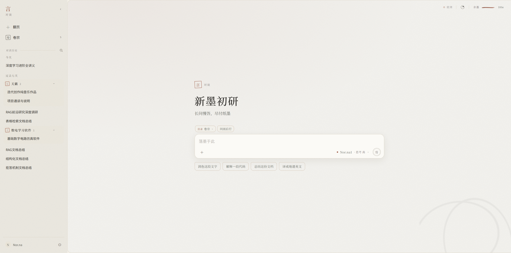

# 言

一个本地运行、零依赖的聊天前端，接 OpenAI 兼容接口，也接 Anthropic 的 Messages API，界面取清简纸墨之意。同一段对话，绑上工作目录即是「行 · 执事」——一个只做代码工作的轻量 Agent，在那个目录里检索、读写、修改文件并执行指令；不绑目录即是「言 · 对谈」——照常聊，需要产出表格、文档、PDF 之类的文件时，同一套工具落在本机的「卷宗」目录里。

> 清简为骨，纸墨为意。长问慢答，尽付纸墨；言毕，即行。

<p align="center">
  
</p>

## 特色

- **言与行，以目录为界**：不是两个入口，而是一段对话有没有绑工作目录；可先聊清一个想法，中途绑上目录再带着上下文动手。[详见](docs/work.md)
- **旁注追问**：在回复里划选一段，右侧开一条附在这一处的小对话——它读得到正文，正文永远读不到它，不明白的地方就地追问而不扰主线。[详见](docs/chat.md#会话与输入)
- **页内可视化**：模型写一页自足的 HTML，在隔离沙箱里就地渲染成可交互的一块，与正文同一张纸；ECharts、Mermaid 随项目本地分发，按需载。[详见](docs/chat.md#呈现)
- **多方模型**：可添多个接口、切换默认模型，OpenAI 兼容与 Anthropic 皆可；思考档位按各家所认自动探明。[详见](docs/models.md)
- **纸墨一以贯之**：印、砚、余墨、落墨与天光，界面与动效同一套笔墨。
- **本地、零依赖、可控**：数据只落在本机的存储目录（默认 `~/.yan/`），不经任何云端；仅需 Node.js 18+，不装 npm 包；指令权限分三档、默认逐条请示，另套一层沙箱。[存储](docs/storage.md) · [权限与沙箱](docs/sandbox.md)

另有卷宗、差遣（子 Agent）、预设、分组、MCP、沙箱环境、记忆，见 [文档](docs/README.md)。

## 快速开始

双击 `start.cmd`，或在项目目录运行：

```powershell
npm start
```

浏览器会打开 `http://127.0.0.1:8787`。在「设置 → 模型」中填写显示名称、模型 ID、Base URL 与 API Key 即可开始。`start.cmd` 打开的窗口即本机桥接，须保持开启。界面里的用法见「设置 → 文档」；VS Code 内使用、直接打开 `index.html`、环境变量见 [启动与运行](docs/start.md)。

## 许可与致谢

本项目以 Apache-2.0 发布，全文见 `LICENSE`。随项目本地分发的开源库：marked（MIT）、DOMPurify（Apache-2.0）、highlight.js（BSD-3-Clause）、KaTeX（MIT）、Mermaid（MIT）、Apache ECharts（Apache-2.0）、PDF.js（Apache-2.0）。许可全文见 `vendor/`。
