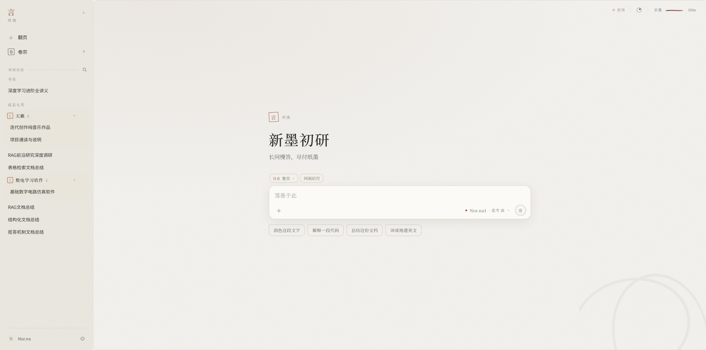
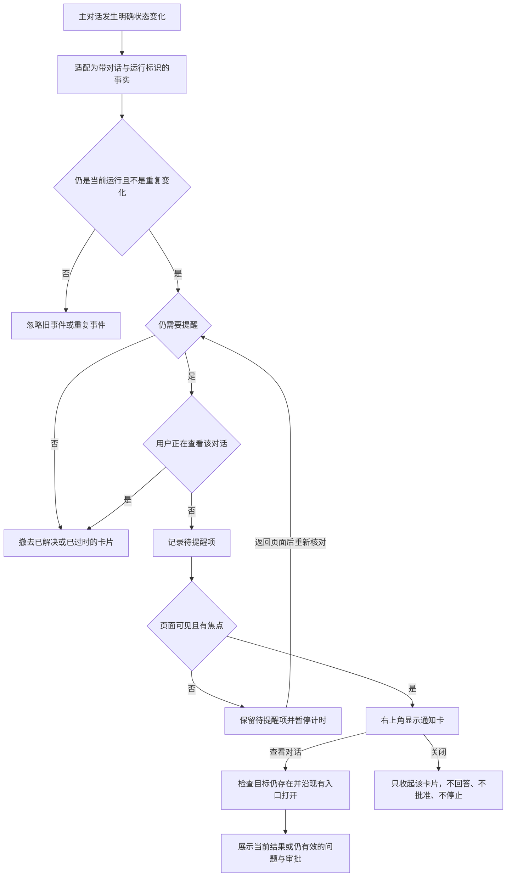
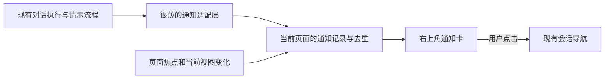

# 言

一个本地运行、零依赖的聊天前端，接 OpenAI 兼容接口，也接 Anthropic 的 Messages API，界面取清简纸墨之意。同一段对话，绑上工作目录即是「行 · 执事」——一个只做代码工作的轻量 Agent，在那个目录里检索、读写、修改文件并执行指令；不绑目录即是「言 · 对谈」——照常聊，需要产出表格、文档、PDF 之类的文件时，同一套工具落在本机的「卷宗」目录里。

> 清简为骨，纸墨为意。长问慢答，尽付纸墨；言毕，即行。

<p align="center">
  
</p>

## 特色

- **言与行，以目录为界**：不是两个入口，而是一段对话有没有绑工作目录；可先聊清一个想法，中途绑上目录再带着上下文动手。[详见](docs/work.md)
- **旁注追问**：在回复里划选一段，右侧开一条附在这一处的小对话——它读得到正文，正文永远读不到它，不明白的地方就地追问而不扰主线。[详见](docs/chat.md#会话与输入)
- **页内可视化**：模型写一页自足的 HTML，在隔离沙箱里就地渲染成可交互的一块，与正文同一张纸；ECharts、Mermaid 随项目本地分发，按需载。[详见](docs/chat.md#呈现)
- **多方模型**：可添多个接口、切换默认模型，OpenAI 兼容与 Anthropic 皆可；思考档位按各家所认自动探明。[详见](docs/models.md)
- **纸墨一以贯之**：印、砚、余墨、落墨与天光，界面与动效同一套笔墨。
- **本地、零依赖、可控**：数据只落在本机的存储目录（默认 `~/.yan/`），不经任何云端；仅需 Node.js 18+，不装 npm 包；指令权限分三档、默认逐条请示，另套一层沙箱。[存储](docs/storage.md) · [权限与沙箱](docs/sandbox.md)

另有卷宗、差遣（子 Agent）、预设、分组、MCP、沙箱环境、记忆，见 [文档](docs/README.md)。

## 快速开始

双击 `start.cmd`，或在项目目录运行：

```powershell
npm start
```

浏览器会打开 `http://127.0.0.1:8787`。在「设置 → 模型」中填写显示名称、模型 ID、Base URL 与 API Key 即可开始。`start.cmd` 打开的窗口即本机桥接，须保持开启。界面里的用法见「设置 → 文档」；VS Code 内使用、直接打开 `index.html`、环境变量见 [启动与运行](docs/start.md)。

## 许可与致谢

本项目以 Apache-2.0 发布，全文见 `LICENSE`。随项目本地分发的开源库：marked（MIT）、DOMPurify（Apache-2.0）、highlight.js（BSD-3-Clause）、KaTeX（MIT）、Mermaid（MIT）、Apache ECharts（Apache-2.0）、PDF.js（Apache-2.0）。许可全文见 `vendor/`。

---

## 后台对话状态通知：设计提案（不要合并）

> **仅供讨论，不是已实现功能；此 PR 不拟合并。** 延续 [#6](https://github.com/Master-Norna/yan/pull/6) 的方式：README 只在独立提案分支中承载流程图、伪代码与验收条件，不拟把这段方案并入正式 README。上面的项目介绍保持原样；不改运行代码、构建产物、依赖或工作流，不依赖未公开的内测架构，不要求按此接口实现或安排开发排期。

### 1. 希望解决的问题与首版范围

同时开着几段对话时，用户正在看 B，A 已经写完、正在提问、需要确认、遇阻或停止，用户不必反复切回检查。希望在 Web 页面右上方出现轻量通知卡，显示**对话标题、状态、查看对话、关闭**；点「查看对话」才切到 A，不自动抢走 B 的输入与焦点。交互意图类似 ChatGPT Web 的后台对话提醒，不要求复制其视觉或内部实现。

这里的「聚焦」不是输入框有没有光标，而是：页面可见且窗口有焦点，处于对话视图，并正在查看该对话。看卷宗、分组或另一段对话都算未查看该对话；遮挡正文的模态界面可由维护者进一步纳入判断。

| 状态来源 | 通知示意 | 不应混淆的情况 |
| --- | --- | --- |
| 本次主对话执行真正收尾 | 「本次回复已完成」或「本次执行已结束」 | 不承诺业务任务验收成功；单次工具结束、自动拟题结束不等于主任务完成 |
| `ask_user` 的问题已挂起并可回答 | 「需要你回答」 | `assistant.status` 仍可能是 `streaming`，不能等整答结束才提醒 |
| 权限审批已挂起 | 「需要你确认后继续」 | 提醒不等于授权，不在卡片中批准命令或切换权限档位 |
| 执行最终中断、失败，或运行层明确报告需人工介入的阻塞 | 「执行遇阻，请查看」 | 普通重试、整理上下文、长时间无 token，不凭计时器猜成阻塞 |
| 本次执行已停止 | 「本次执行已停止」 | 不把自动续写／补言引导中的内部流中止当作用户停止 |

「需要提问」首版以结构化 `ask_user`／运行层等待输入为准；不扫描正文问号，也不额外调用模型判别。普通自然语言追问若没有结构化状态，只能作为回复结束提示，不假称已可靠识别为待回答。将来运行层提供明确的等待输入事件时，再在适配处补上即可。

首版聚焦主对话。子 Agent、拟题、压缩等内部任务的完成不各弹一条；它们需要用户处理的问题可归到所属主对话。旁注独立任务的专门定位另行讨论。只做**页内通知**，不申请系统通知权限、不接 Web Push／Service Worker、不新增后台服务、轮询或模型请求。

### 2. 已核对的公开代码接缝（不是施工要求）

调研基线为上游 `55ec469292a5768aadb2ce0f1fb9ead576a1857d`；内测版本可能变化，以下只说明所需行为可以落在哪些现有职责附近。

| 已有位置 | 当前行为与参考接法 |
| --- | --- |
| [`src/14-chat-engine.js`](https://github.com/Master-Norna/yan/blob/55ec469292a5768aadb2ce0f1fb9ead576a1857d/src/14-chat-engine.js) · `streamReply` | 维护运行 job，最终写入 `complete`／`stopped`／`interrupted`／`error`；`finally` 中已有后台 `conversation.unread` 标记。应观察收尾后的结果，不能把进入 `finally` 本身当成功 |
| 同文件 · `stopGeneration`、`settleSupplements` | 停止与收尾可能先后触达同一答；补言还可能在收尾后作为新一问自动发送。要合并停止事件，并在已知有后续执行时避免抢先报完成 |
| [`src/15-tools/02-approval.js`](https://github.com/Master-Norna/yan/blob/55ec469292a5768aadb2ce0f1fb9ead576a1857d/src/15-tools/02-approval.js) · `askApproval` | `pendingApprovals` 记录挂起步骤；应在登记成功后提醒，在回答、跳过、撤销或停止后同步撤去失效卡片。根据工具区分问题与权限确认 |
| [`src/06-mode-welcome.js`](https://github.com/Master-Norna/yan/blob/55ec469292a5768aadb2ce0f1fb9ead576a1857d/src/06-mode-welcome.js) · `openConversation` | 现有入口处理草稿、滚动位置、视图切换与未读；通知点击应复用这条路径，不自行只写 `currentId` |
| [`src/03-ui-utils.js`](https://github.com/Master-Norna/yan/blob/55ec469292a5768aadb2ce0f1fb9ead576a1857d/src/03-ui-utils.js) · `toast` | 已有普通文本操作反馈；本提案需要绑定会话、可跳转且可去重的通知，不要求把全部普通 toast 改成会话通知 |

当前公开消息状态没有在这里直接提供统一的 `blocked` 枚举；下文的 `blocked` 是**通知语义**，不是声称仓库已经有同名业务状态。通知只读运行事实，不替运行层发明状态，不改原有未读机制和权限判定。

### 3. 用户流程与分层


```mermaid
flowchart TD
    A[主对话发生明确状态变化] --> B[适配为带对话与运行标识的事实]
    B --> C{仍是当前运行且不是重复变化}
    C -->|否| X[忽略旧事件或重复事件]
    C -->|是| D{仍需要提醒}
    D -->|否| Y[撤去已解决或已过时的卡片]
    D -->|是| E{用户正在查看该对话}
    E -->|是| Y
    E -->|否| F[记录待提醒项]
    F --> G{页面可见且有焦点}
    G -->|否| H[保留待提醒项并暂停计时]
    H -->|返回页面后重新核对| D
    G -->|是| I[右上角显示通知卡]
    I -->|查看对话| J[检查目标仍存在并沿现有入口打开]
    J --> K[展示当前结果或仍有效的问题与审批]
    I -->|关闭| L[只收起该卡片，不回答、不批准、不停止]
```


```mermaid
flowchart LR
    R[现有对话执行与请示流程] --> A[很薄的通知适配层]
    A --> N[当前页面的通知记录与去重]
    V[页面焦点和当前视图变化] --> N
    N --> U[右上角通知卡]
    U -->|用户点击| O[现有会话导航]
```

页面隐藏时收到的状态先留待展示；重新回来时若已经在目标对话，就收起该通知，不补弹一个已经看到的旧消息。其他对话仍有效的提醒再显示。网页被关闭、刷新或浏览器暂停后，不保证继续接收或补报历史事件。

首版只由**持有该运行的页面**产生事件；其他只读同步页面不能因读到 `unread` 或历史 `complete` 而重新造通知。这避免多个页面同步存储时把同一完成重复播报，但也意味着不承诺任意标签页都能收到另一页任务的实时提醒。跨标签页统一投递可后续另议，不为本提案引入主标签选举系统。

### 4. 运行事实与归类伪代码

以下 `Source`、`Navigation`、`Cards` 等都是**行为占位**，不是仓库已有 API。可用既有函数与很少量页面内状态实现，不要求新的框架、状态管理库或事件总线。

```javascript
// 一次用户执行的上下文，固定绑定实际运行，不读事后切换了的“当前对话”。
// runId 区分同一 assistant 消息的手动继续／重试；不能只用 assistant.id 去重。
// 自动网络重试、自动续写与工具轮仍属于原 runId。
const fact = {
  conversationId: "所属主对话 ID",
  assistantId: "所属回复 ID",
  runId: "本次执行的稳定标识",
  revision: 3,                  // 通知语义真正变化时递增；重绘／token 更新不递增。
  kind: "needs_input",          // quiet | completed | needs_input | blocked | stopped
  pendingStepId: "待回答步骤 ID", // 可为空；不同问题必须有不同的身份。
  reasonCode: "question",       // 固定的语义码，不把完整错误或命令塞进卡片。
  messageId: "可选定位锚点"
};

function classify(s) {
  // 删除／卸载是销毁流程，不在这里制造“后台任务停止”的通知。
  if (s.disposing) return { kind: "quiet" };
  if (s.settled && s.status === "stopped") return { kind: "stopped" };
  if (s.settled && ["interrupted", "error"].includes(s.status))
    return { kind: "blocked", reasonCode: "execution_failed" };
  if (s.pendingQuestion) return {
    kind: "needs_input", pendingStepId: s.pendingQuestion.id, reasonCode: "question"
  };
  if (s.pendingApproval) return {
    kind: "blocked", pendingStepId: s.pendingApproval.id, reasonCode: "approval"
  };
  if (s.explicitBlock && !s.autoRecoveryPending)
    return { kind: "blocked", reasonCode: s.explicitBlock.code };
  if (s.settled && s.status === "complete" && !s.followUpQueued)
    return { kind: "completed" };
  return { kind: "quiet" };     // 正在工作／自动恢复／等待已解除，均不报“完成”。
}

// 适配契约（按作者届时的架构落实，不在本 PR 修改这些函数）：
// 1. 开始执行：绑定新 runId 为该对话的最新运行，发布 quiet，清掉上一轮旧卡片。
// 2. askApproval 已登记：取结构化的待答／待确认步骤，发布对应事实。
// 3. 等待解除：重新归类为 quiet 或下一条有效等待；卡片不是运行状态的主人。
// 4. 最终收尾：状态、挂起步骤、补言后续安排均已确定后，再以 settled=true 归类。
//    followUpQueued 必须在补言队列被消耗前记下，不能拿已清空队列误判“没有后续”。
// 5. stopGeneration 与异常收尾汇到同一个逻辑状态变化，同一停止只分配一次 revision。
//    内部 round.abort() 只用于引导／续写时，不发布用户 stopped。
// 6. Source 对相同语义（runId、kind、pendingStepId、reasonCode）保持相同 revision；
//    改名、token、用量、渲染和存储同步不产生新 revision。
// 通知观察回调必须隔离异常，绝不能因渲染卡片失败而改变模型执行或审批结果。
```

这里的 `settled` 只表示本次执行结果已确定，不声称所有持久化均已成功。卡片只说执行状态；保存失败仍沿用原有反馈，不把两件事混为一谈。无法确认的状态保持原有提示，不编造成功或失败。

### 5. 接收、去重与可见性伪代码

```javascript
const notices = new Map();      // conversationId -> 当前最多一张通知记录
const watermarks = new Map();   // runId -> 已接收的通知语义 revision

function pageAttended() {
  return document.visibilityState === "visible" && document.hasFocus();
}
function isViewing(id) {
  return pageAttended() && view === "chat" && currentId === id;
}
function receive(f) {
  // 只接受本页运行层的已知事实，不接模型输出、历史回放或其他页同步记录冒充的事件。
  if (!Source.ownsLocalUserRun(f) || !Source.isLatestRun(f)) return;
  if (f.revision <= (watermarks.get(f.runId) ?? -1)) return;
  watermarks.set(f.runId, f.revision);
  notices.delete(f.conversationId); // 新的事实取代旧卡片，包括 question -> quiet。
  if (f.kind !== "quiet" && Source.isStillCurrent(f) && !isViewing(f.conversationId)) {
    notices.set(f.conversationId, {
      ...f,
      key: `${f.runId}:${f.revision}`,
      remainingVisibleMs: f.kind === "completed" ? 8000 : null
    });
  }
  reconcile();
}
function reconcile() {
  for (const [id, n] of notices) {
    if (!Source.conversationExists(id) || !Source.isStillCurrent(n) || isViewing(id)) {
      Cards.remove(n.key);
      notices.delete(id);
    }
  }
  if (!pageAttended()) return Cards.hideAndPauseAll();
  // 最多同时露出三张，其余折为“另有 N 段对话有更新”的可展开小列表。
  // 待答／待确认／遇阻优先，其后停止、完成；同级按到达顺序，未展示项不计时。
  Cards.render(notices, { maxVisible: 3 });
}
function dismiss(n) {
  if (notices.get(n.conversationId)?.key !== n.key) return;
  notices.delete(n.conversationId);
  Cards.remove(n.key);
  reconcile();                    // 补上队列里下一张；watermarks 不回退。
  // 不改 conversation.unread，不 settleApproval，不停止任务。
}
// visibilitychange、窗口 focus/blur、应用视图或对话切换后调用 reconcile。
// 新运行／等待解除／终态变化调用 receive；删除目标也必须触发清理。
// Cards 隐藏／移除后清掉旧 DOM；旧卡定时器只可按 key 关闭自己，不能关闭新卡。
// 完成卡的 8 秒仅为建议：实际可见且窗口有焦点时计时，悬停或键盘聚焦时暂停。
// 待回答、待确认、遇阻和停止卡默认不自动消失；关闭仍只影响卡片。
// 运行句柄失效后拒绝它的迟到回调，再回收 watermark；删除会话与页面卸载清理记录、定时器和监听。
```

不因用户切换焦点反复创建同一事件。卡片关闭／过期后，同一 revision 不再出现；新的问题、恢复后的再次阻塞或新一轮执行仍可正常提醒。看到／关闭通知与处理业务是两件事：问题还在原对话里等答，审批还在原入口里等确认。

### 6. 点击跳转与展示边界伪代码

```javascript
async function visit(n) {
  if (Cards.isOpening(n.key)) return; // 防止连点。
  if (!Source.conversationExists(n.conversationId)) {
    dismiss(n);
    return toast("这段对话已不在");
  }
  Cards.setOpening(n.key, true);
  try {
    // 复用 openConversation 的路径，保留原对话的文字、附件、引用及滚动位置。
    // 只接受本地已有会话 ID；不能导航到模型提供的 URL，不能自动重跑任务。
    await Navigation.openExistingPreservingDraft(n.conversationId);
    // 导航／渲染期间用户又切走，就不再拉回来，也不把其他新通知标成已看。
    if (!isViewing(n.conversationId) || !Source.conversationExists(n.conversationId)) return;
    if (Source.isStillCurrent(n)) {
      // 问题／审批仍有效才定位相应入口；点击只定位，不调用 settleApproval。
      // 锚点已不在当前分支时退回该对话当前内容，不偷偷切换分叉。
      Navigation.revealExistingAnchorOrCurrentContent(n);
    }
    dismiss(n);                  // key 校验保证不会误删执行期间刚出现的新提醒。
  } catch (error) {
    Cards.showNavigationFailure(n.key); // 保留能重试的记录；不清空原草稿。
  } finally {
    Cards.setOpening(n.key, false);
  }
}
```

卡片标题用当前会话名称并截断显示；正文只用固定状态说明，默认不放完整问题、路径、命令、密钥或模型回复。标题等外来文本用 `textContent`，不用作 HTML。提供独立的「查看对话」和「关闭」按钮，避免可点击卡片里嵌套按钮；键盘可操作，状态文本通过温和的 live region 宣告，通知出现时不移动焦点。跳转之后也不自动提交表单。

位置建议为顶栏下方右侧独立容器，避免遮住已有菜单／行迹操作；窄屏收成单列并留安全边距，动画沿用主题并尊重减少动效设置。沿用「言」的视觉语言，不引入新的 UI 库。更多通知只需同一区域的折叠列表，不扩成独立消息中心。

焦点与可见性的基础可参考 [MDN · Page Visibility API](https://developer.mozilla.org/en-US/docs/Web/API/Page_Visibility_API)、[Document.hasFocus](https://developer.mozilla.org/en-US/docs/Web/API/Document/hasFocus)；不抢焦点的状态宣告参考 [W3C · Status Messages](https://www.w3.org/WAI/WCAG22/Understanding/status-messages.html)。这些文档解释平台能力，不替代项目中的真实交互验证。

### 7. 后续实现时的验收清单（本 PR 未执行）

| 编号 | 场景 | 应满足的结果 |
| --- | --- | --- |
| N01 | 看 B 时 A 完成；看 A 时 A 完成 | 前者右上角一张卡且不抢 B 输入，后者不弹；现有未读行为不被通知层破坏 |
| N02 | A 后台进入 `ask_user`，整答仍是 `streaming` | 立即提示待回答；同一步重新渲染不重复通知，不误报完成 |
| N03 | A 等待命令审批，点击／关闭通知 | 点击只打开 A；关闭不批准、不跳过、不变更权限 |
| N04 | 问题已回答／撤销，或权限已在原入口处理 | 旧待办卡片及时撤去；迟到回调不把旧问题复活 |
| N05 | 网络重试、自动续写、上下文整理、普通工具中间失败 | 不提前报停止／完成／阻塞；最终确需介入才提醒 |
| N06 | `stopGeneration` 后又进入 `finally` | 同一次停止最多一条；不能先显示完成再显示停止 |
| N07 | 补言在收尾时自动接成下一问；子任务或拟题结束 | 不把内部／中间结束报成整个主对话已经做完 |
| N08 | 同一 assistant 消息手动继续；旧运行晚到 | 新执行可正常提醒，旧 runId 被拒绝，旧定时器不能关掉新卡 |
| N09 | 页面隐藏或窗口失焦时完成／待答，之后返回 | 未展示时间不消耗倒计时；重新核对后只显示仍有效且未查看的对话 |
| N10 | 多段对话同时更新，鼠标悬停／键盘停在卡片上 | 最多三张，剩余可展开访问；不覆盖彼此，不在交互中消失 |
| N11 | B 有文字、附件、引用草稿，点卡跳 A 再回 B | 草稿与滚动按既有导航保留，不自动发送、重试或批准 |
| N12 | A 改名、删除、分叉切换；导航异步期间又切去 C | 用 ID 找对话，目标失效友好提示，不跳错；不强行从 C 拉回 A |
| N13 | 重绘、存储同步、另一个只读标签页打开旧历史 | 不制造新通知；首版不宣称支持跨标签页实时统一投递 |
| N14 | 普通回复带问号但无结构化等待；长时间不出 token | 不凭正文／超时猜待答或阻塞，明确保留首版限制 |
| N15 | 通知渲染失败、关闭卡片、删除运行中的对话 | 不影响执行与审批；不清业务未读；删除／卸载不造停止通知 |
| N16 | 标题含 HTML、窄屏、键盘与读屏、减少动效 | 文本不执行；按钮可达、状态可获知、无强制焦点或遮挡关键操作 |

建议把归类、过期事件与去重做成纯函数用例，再沿项目既有浏览器测试补导航与通知交互；这里仅列目标，不添加或宣称已通过任何测试。

本提案只提供一种可拆取的参考方案。是否采用、通知措辞与停留时间、具体接入位置，以及内测后是否扩展跨标签页或旁注通知，均由维护者决定；无须合并本 PR。
