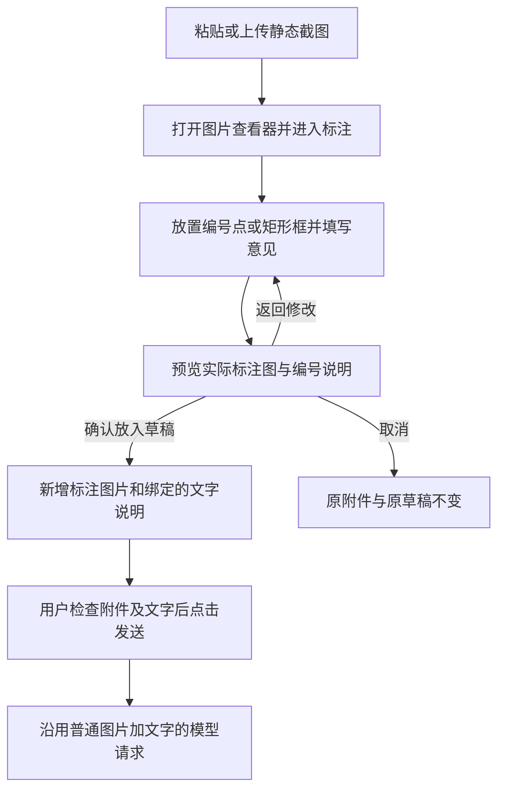
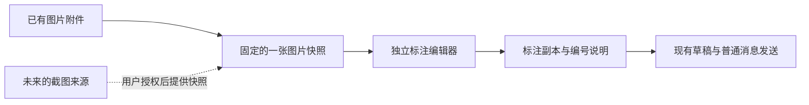

# 言

一个本地运行、零依赖的聊天前端，接 OpenAI 兼容接口，也接 Anthropic 的 Messages API，界面取清简纸墨之意。同一段对话，绑上工作目录即是「行 · 执事」——一个只做代码工作的轻量 Agent，在那个目录里检索、读写、修改文件并执行指令；不绑目录即是「言 · 对谈」——照常聊，需要产出表格、文档、PDF 之类的文件时，同一套工具落在本机的「卷宗」目录里。

> 清简为骨，纸墨为意。长问慢答，尽付纸墨；言毕，即行。

<p align="center">
  
</p>

## 特色

- **言与行，以目录为界**：不是两个入口，而是一段对话有没有绑工作目录；可先聊清一个想法，中途绑上目录再带着上下文动手。[详见](docs/work.md)
- **旁注追问**：在回复里划选一段，右侧开一条附在这一处的小对话——它读得到正文，正文永远读不到它，不明白的地方就地追问而不扰主线。[详见](docs/chat.md#会话与输入)
- **页内可视化**：模型写一页自足的 HTML，在隔离沙箱里就地渲染成可交互的一块，与正文同一张纸；ECharts、Mermaid 随项目本地分发，按需载。[详见](docs/chat.md#呈现)
- **多方模型**：可添多个接口、切换默认模型，OpenAI 兼容与 Anthropic 皆可；思考档位按各家所认自动探明。[详见](docs/models.md)
- **纸墨一以贯之**：印、砚、余墨、落墨与天光，界面与动效同一套笔墨。
- **本地、零依赖、可控**：数据只落在本机的存储目录（默认 `~/.yan/`），不经任何云端；仅需 Node.js 18+，不装 npm 包；指令权限分三档、默认逐条请示，另套一层沙箱。[存储](docs/storage.md) · [权限与沙箱](docs/sandbox.md)

另有卷宗、差遣（子 Agent）、预设、分组、MCP、沙箱环境、记忆，见 [文档](docs/README.md)。

## 快速开始

双击 `start.cmd`，或在项目目录运行：

```powershell
npm start
```

浏览器会打开 `http://127.0.0.1:8787`。在「设置 → 模型」中填写显示名称、模型 ID、Base URL 与 API Key 即可开始。`start.cmd` 打开的窗口即本机桥接，须保持开启。界面里的用法见「设置 → 文档」；VS Code 内使用、直接打开 `index.html`、环境变量见 [启动与运行](docs/start.md)。

## 许可与致谢

本项目以 Apache-2.0 发布，全文见 `LICENSE`。随项目本地分发的开源库：marked（MIT）、DOMPurify（Apache-2.0）、highlight.js（BSD-3-Clause）、KaTeX（MIT）、Mermaid（MIT）、Apache ECharts（Apache-2.0）、PDF.js（Apache-2.0）。许可全文见 `vendor/`。

---

## 图片／截图标注：设计提案（不要合并）

> **仅供讨论，不是已实现功能；此 PR 不拟合并。** README 只在提案分支中作为讨论载体，上面的项目说明保持原样。本提案不修改运行代码、构建产物或依赖，不要求接入任何未公开的实现，也不约定开发排期。以下接口均为伪代码，不是仓库已有 API。

### 1. 希望解决的问题

辅助修改前端时，用户在截图中指出“哪里需要改”，为每处写一句意见，再把位置与意见一起交给主对话中的模型。例如：① 侧栏过宽；② 标题与次要说明的层级不清楚；③ 工作台应在需要时展开。

首版建议只做静态图片：编号点、矩形框、对应文字、修改／撤销／删除，以及确认预览。界面措辞、入口和排版由项目决定。先不做画笔工具箱、DOM／组件源码定位、自动截屏、鼠标键盘控制或自动改代码。标注也不等于授权执行任何操作。

### 2. 交互流程


```mermaid
flowchart TD
    A[粘贴或上传静态截图] --> B[打开图片查看器并进入标注]
    B --> C[放置编号点或矩形框并填写意见]
    C --> D[预览实际标注图与编号说明]
    D -->|返回修改| C
    D -->|确认放入草稿| E[新增标注图片和绑定的文字说明]
    D -->|取消| X[原附件与原草稿不变]
    E --> F[用户检查附件及文字后点击发送]
    F --> G[沿用普通图片加文字的模型请求]
```

标注完成不自动发送。标注副本不覆盖原件；既有的草稿附件不被悄悄删除。若原图仍在草稿中，预览应明确显示实际会发送哪些图片，由用户决定是否移除原图。对历史图片再次标注，产生新的附件与新消息，不改写旧消息。

### 3. 与 computer use 的边界


```mermaid
flowchart LR
    A[已有图片附件] --> S[固定的一张图片快照]
    B[未来的截图来源] -. 用户授权后提供快照 .-> S
    S --> E[独立标注编辑器]
    E --> P[标注副本与编号说明]
    P --> D[现有草稿与普通消息发送]
```

标注编辑器只消费一张固定快照，不关心截图如何获得。后续截图功能可提供相同输入，而无须让标注依赖某个 computer use 实现。新截图必须是新快照，旧标记不能静默套到新的画面；图上的坐标只是视觉位置，不是桌面点击指令。

### 4. 最小数据结构（示意）

```javascript
// 图片在本次编辑中固定不变；尺寸以解码并校正方向后的像素为准。
// 不把屏幕位置、浏览器缩放或设备像素比当作图片坐标。
const source = {
  attachmentId: "原附件引用",
  snapshotId: "本次快照标识",
  width: 1600,
  height: 900
};

const annotation = {
  id: "稳定标记标识",       // 编辑、撤销时用；不是数组下标。
  number: 1,               // 图和说明使用同一个编号；删除后允许留空号。
  kind: "rect",            // "point" 或 "rect"。
  geometry: { x: 0.10, y: 0.20, w: 0.25, h: 0.15 },
  text: "这里的标题层级不清楚"
};
// 坐标均为相对整张图片的 0..1 比例；point 只需要 x、y。
// 完整编辑记录 = 固定快照 + annotations + nextNumber。
// 草稿包 = 标注副本 + 对应编号说明；它是内部逻辑分组，不是新的模型协议。
```

### 5. 坐标与编号伪代码

```javascript
// 模块一：把指针位置换成相对图片坐标。
// imageRect 必须是图片实际内容的显示区域，不含查看器边框或留白。
// 首版不提供裁剪、旋转；缩放或滚动后重新取得这个区域。
function toImagePoint(pointer, imageRect, allowOutside = false) {
  if (!finitePositiveRect(imageRect) || !finitePoint(pointer)) return null;
  const x = (pointer.clientX - imageRect.left) / imageRect.width;
  const y = (pointer.clientY - imageRect.top) / imageRect.height;
  if (!allowOutside && (x < 0 || x > 1 || y < 0 || y > 1)) return null;
  return { x: clamp(x, 0, 1), y: clamp(y, 0, 1) };
}
// 拖框起点必须在图内；终点可裁到图片边缘。
// 矩形取两端的 min 和绝对差，拒绝零面积；不乘 devicePixelRatio。

// 模块二：新增标记。撤销时恢复整份编辑状态，包括 nextNumber。
function addAnnotation(editor, kind, geometry, text) {
  validateGeometry(kind, geometry);  // 有限数、范围正确、矩形不能越界。
  validateText(text);               // 要有说明，并限制长度和标记总数。
  editor.undo.push(copyEditableState(editor));
  editor.annotations.push({
    id: newId(),
    number: editor.nextNumber++,
    kind,
    geometry,
    text: text.trim()
  });
  redrawOverlay(editor);            // 编号贴近标记；长说明留在图外。
}
```

### 6. 生成附件与放入草稿的伪代码

```javascript
// 模块三：用户确认预览后，生成一个不覆盖原图的副本。
// 下列 Draft、Attachments、render 等只是接口占位，表示所需行为。
async function prepareForDraft(editor, targetDraft) {
  if (editor.busy) return;          // 防止连点造成重复附件。
  editor.busy = true;
  const expectedRevision = targetDraft.revision;
  const snapshot = freezeCopy(editor.source, editor.annotations);
  let staged = null;
  try {
    validateSnapshot(snapshot);     // 原件存在、方向/尺寸一致、内容完整。
    validateImageBudget(snapshot);  // 限制解码像素数与输出大小，避免内存暴涨。

    // 图与文字必须来自同一份冻结记录，避免异步绘制时串号。
    const image = await renderAnnotatedCopy(snapshot);
    const notes = describeAnnotations(snapshot);
    // 绘图按比例映射到导出图片：x * outputWidth，y * outputHeight。
    // 标记不能只留在屏幕覆盖层里，必须真的进入导出的图片。
    // 说明使用普通文本显示，不将用户输入作为 HTML 或脚本执行。

    staged = await Attachments.stageNew(image); // 新 ID；原附件不变。
    await Draft.appendBundleIfUnchanged({
      draftKey: targetDraft.key,    // 绑定打开编辑器时的目标，不取“当前会话”。
      expectedRevision,
      sessionToken: editor.sessionToken, // 取消/关闭时撤销；失效就不追加。
      imageRef: staged.ref,
      notes
    });
    // 此接口要求：会话仍激活、编辑令牌有效且草稿未变，再一次性追加图与说明。
    // 若用户切换会话或修改草稿，停止提交并让用户确认，不覆盖新输入。
    // 持久化与并发处理按项目既有方式实现，不要求新建数据库事务系统。
    staged = null;                 // 新件已归草稿持有，不能再当失败残留删除。
    closeEditor();
  } catch (error) {
    // 只回收已确认未被任何草稿/消息引用的新件；结果未知时先核实归属。
    if (staged) await Attachments.discardOnlyIfUnreferenced(staged);
    keepEditorAndReport(error);     // 意见与原图仍在，用户可以重试。
  } finally {
    editor.busy = false;
    releaseTemporaryGraphics();     // 释放临时画布、位图、对象 URL 等资源。
  }
}
```

`Draft.appendBundleIfUnchanged` 的成功必须表示图与说明已共同保存；保存状态未知时，不宣称成功，也不删除可能已被引用的新附件。移除整个标注包时仅移除它自己的图片和生成说明，不清空用户输入。

发送时，内部标注包展开为普通的“图片附件 + 消息正文”，不新增工具、不改权限。文字建议包括图片名／快照标识、编号及意见；多张图各有自己的说明分组。模型需要图片输入能力，不支持时明确提示，不能声称已经读图。截图内容和标注说明都不提升为 system 指令。

历史轮次是否保留图片沿用项目策略，但编号说明需保留在消息正文。后续用户要求重新观察旧标注图时，应明确再次附图或走已支持的取图路径，不假定模型还看得到原始像素。

### 7. 当前公开代码的参考点（不是指定改造方案）

以下只以公开 `55ec469292a5768aadb2ce0f1fb9ead576a1857d` 为参考。私有开发或重构可采用完全不同的入口。

| 参考位置 | 已有职责与可讨论的衔接点 |
| --- | --- |
| [`src/09-attachments-ui.js`](https://github.com/Master-Norna/yan/blob/55ec469292a5768aadb2ce0f1fb9ead576a1857d/src/09-attachments-ui.js) | 附件卡片与打开事件；可讨论标注入口。 |
| [`src/12-composer.js`](https://github.com/Master-Norna/yan/blob/55ec469292a5768aadb2ce0f1fb9ead576a1857d/src/12-composer.js) | 图片查看与原图／适应切换；可复用容器，编辑逻辑单独组织。 |
| [`src/13-files.js`](https://github.com/Master-Norna/yan/blob/55ec469292a5768aadb2ce0f1fb9ead576a1857d/src/13-files.js) | 附件导入；标注副本仍可作为普通图片。 |
| [`src/14-chat-engine.js`](https://github.com/Master-Norna/yan/blob/55ec469292a5768aadb2ce0f1fb9ead576a1857d/src/14-chat-engine.js) | `takeComposer` / `messageForApi` 装配文字与附件；旧轮次图片会转成占位说明，因此不能只把意见画进图片。 |

一种轻量实现选择是原生 DOM／SVG 做编辑覆盖层、Canvas 做导出；不以引入运行时依赖为前提。具体存储字段和重构方式留给实现阶段确认。

### 8. 将来实现时的验收清单（尚未执行）

| 场景 | 期望结果 |
| --- | --- |
| 适应／原图切换、浏览器缩放、图片留白与滚动 | 标记仍对准同一图像位置，点在留白中不会创建标记。 |
| 拖框越界、无效尺寸、删标记再新增／撤销 | 坐标有效；图上编号与文本一致，不按数组下标错配。 |
| 多张图、切换会话、生成副本时编辑草稿或连点确认 | 不串图、不串会话、不覆盖新输入，不产生重复包。 |
| 取消、读图失败、存储失败、提交结果未知 | 原件与已有草稿不受破坏；保留意见，核实归属后处理残留。 |
| 检查实际模型请求与导出图片 | 真正发送带标记的图片及对应文字，不是未标注原图或仅 UI 覆盖层。 |
| 后续追问、重开对话、再标注历史图片 | 文字说明可追溯；重看图片有明确路径；历史附件不被改写。 |
| 普通附件／图片预览、两种供应商格式、资源限制 | 既有功能不退化；不支持的图片能力明确报出；关闭后释放临时资源。 |

本提交只有方案文档。未实现功能、未运行上述行为测试，也不把伪代码当作生产实现。可先讨论功能是否这样收敛，再由维护者选择有用的部分，无须合并本 PR。
