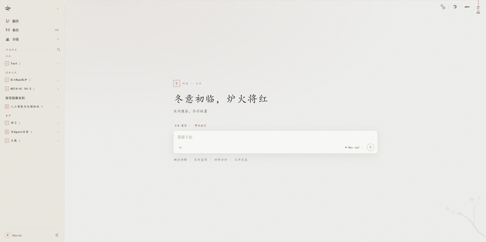
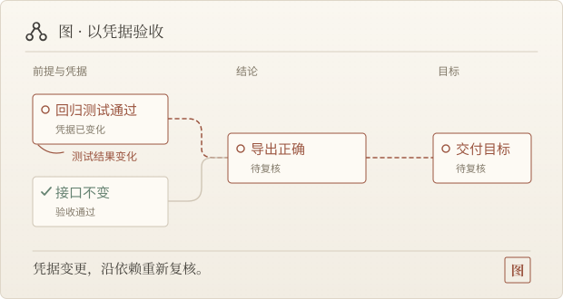
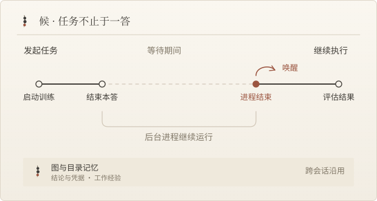
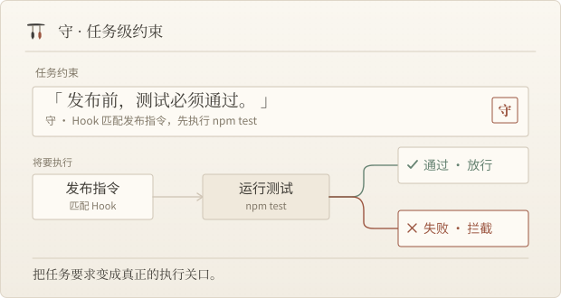
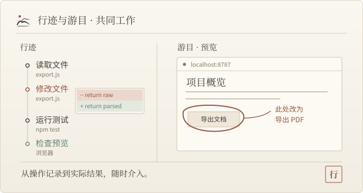

<div align="center">


<h1>言 · Yan</h1>

<strong>从一席对谈，到一件事做成。</strong>

<p>清简为骨，纸墨为意。</p>

<a href="LICENSE"></a>
<a href="https://github.com/Master-Norna/yan/releases/latest"></a>
<a href="docs/models.md"></a>

[下载](https://github.com/Master-Norna/yan/releases/latest) · [文档](docs/README.md) · [English](README.en.md)

</div>

言将对话、研究、开发与任务执行置于同一环境。模型由用户选择，任务在本地目录中持续推进，执行过程与交付成果可查。对谈中绑定目录，即可带着已有上下文进入执行。

<p align="center">
  
</p>

## 核心体验

<table>
<tr>
<td width="45%" valign="middle"><h3>以验收为中心的长程执行</h3><p>「图」将任务组织为结论、依赖与验收凭据，而非待办清单。文件、测试或探针结果变化时，关联结论转为待复核；收尾前，模型重新对照用户最初的目标自判完成情况。</p><a href="docs/work.md#图">了解更多</a></td>
<td width="55%" valign="middle"></td>
</tr>
<tr>
<td width="55%" valign="middle"></td>
<td width="45%" valign="middle"><h3>跨会话持续推进</h3><p>「候」以进程结束或定时事件唤醒模型，避免无效等待；「差遣」支持帮手分工。图与目录记忆独立于单次对话保存，新会话可以承接已有进展和约束。</p><a href="docs/work.md#候">了解更多</a></td>
</tr>
<tr>
<td width="45%" valign="middle"><h3>任务级的可编程约束</h3><p>「守」将任务要求落实为可执行的 Hook：匹配指定动作，执行前运行测试、拦截或请求批准；也可在收尾时复查测试和探针。约束随任务延续，不仅依靠提示词。</p><a href="docs/work.md#图">了解更多</a></td>
<td width="55%" valign="middle"></td>
</tr>
<tr>
<td width="55%" valign="middle"></td>
<td width="45%" valign="middle"><h3>可审阅、可介入的执行</h3><p>「行迹」保留操作与文件变更，工作区支持查看差异和按答复回退改动。「游目」呈现模型操作的浏览器，人可直接接管、圈点引用，与 Agent 共享工作现场。</p><a href="docs/stage.md">了解更多</a></td>
</tr>
</table>

## 产品能力

| 对话与创作 | 检索与研究 |
| --- | --- |
| 多轮对话、分支与版本、旁注、补言、附件阅读、交互图表。 | 网络检索、网页阅读、浏览器操作及圈点引用。 |
| **代码与文件** | **文档与交付** |
| 文件读写、目录检索、终端执行、差异查看与回退。 | 卷宗管理，文档、表格、演示文稿及 PDF 预览。 |
| **记忆与个性化** | **模型与工具** |
| 跨会话记忆、目录记忆、预设与会话分组。 | 自主选择模型，接入 MCP、Skills 与本机工具。 |

## 安全与控制

按场景选择问而后行、审而后行或径行。权限档位、沙箱规则、独立审查与任务守则形成不同层次的控制。

- **规则与沙箱**：按权限档位限制指令与文件操作，对明确风险拦截或转为请示。
- **独立模型审查**：可配置专司审查模型，结合用户原始指令判断规则标疑的操作。
- **任务守则（Hook）**：在副作用发生前匹配指令、文件、网址或工具，进行测试、拦截或请示。
- **追溯与回退**：操作与变更留下行迹，可审阅差异与回退一答的文件改动。

实际保护范围取决于权限档位与配置。[权限与沙箱](docs/sandbox.md)。

## 纸墨设计

<div align="center">
　　　
</div>

笔意图标、朱印反馈、墨历与天光主题构成统一的交互视觉语言。 用量化作余墨，使用记录落成墨历；寄出是一方朱印，明暗随天光流转。

## 模型自主与开放生态

自主选择模型接口，按需配置审查等专司；通过 MCP 与 Skills 扩展工作能力。对话与配置保存在本机，发给模型或外部工具的内容由相应服务处理。接口支持硅基流动、OpenAI 兼容、Anthropic 与 ChatGPT 订阅。

### 合作伙伴

<a href="https://siliconflow.cn" title="硅基流动 SiliconFlow"><picture><source media="(prefers-color-scheme: dark)" srcset="assets/powered-by-siliconflow-dark.png"></picture></a>

言与 [硅基流动 SiliconFlow](https://siliconflow.cn) 合作：在「设置 → 模型」的接口里选「硅基流动」，填上自己的 API Key 即可。图文步骤见硅基流动官方文档里的[《在言中使用硅基流动》](https://docs.siliconflow.cn/docs/usercases/use-siliconcloud-in-yan)。

## 开始使用

**Windows**：到 [Releases](https://github.com/Master-Norna/yan/releases/latest) 下载 `yan-<版本>-win-x64.zip`，解开后双击 `言.exe`。头一回若提示「已保护你的电脑」，点「更多信息 → 仍要运行」（`言.exe` 未签名）。

**macOS（Apple 芯片）**：到 [Releases](https://github.com/Master-Norna/yan/releases/latest) 下载 `yan-<版本>-mac-arm64.zip`，解压后双击「言」文件夹里的 `start.command`。包里自带 Node；若首次打开被系统拦下，见[启动与运行](docs/start.md#macos-便携包)。

**从源码**：装好 Node.js 22 或更高版本，双击 `start.cmd`（macOS 用 `start.command`），或运行：

```powershell
npm start
```

浏览器打开 `http://127.0.0.1:8787`，在「设置 → 模型」接入一个模型，即可落笔。`start.cmd` 打开的窗口是本机桥接，用时须开着。VS Code 内使用、环境变量、macOS 上的差别，见 [启动与运行](docs/start.md)。


## 文档

界面里的用法在「设置 → 文档」；各处的细节与做法见 [docs](docs/README.md)。

## 参与开发

欢迎提 issue 与 PR。动手前请读 [参与言的开发](CONTRIBUTING.md)：流程、本地怎么跑、项目的几条取舍。

## 许可与致谢

本项目以 Apache-2.0 发布，全文见 `LICENSE`。随项目本地分发的开源库：marked（MIT）、DOMPurify（Apache-2.0）、highlight.js（BSD-3-Clause）、KaTeX（MIT）、Mermaid（MIT）、Apache ECharts（Apache-2.0）、PDF.js（Apache-2.0），许可全文见 `vendor/`。

## 开源贡献

维护者与 Agent 账号参与的上游开源贡献，其中包含由言辅助完成的工作。卡片自动更新自公开已合并的 PR，不将全部贡献归因于 Agent。

<p align="center">
  <a href="https://github.com/Master-Norna/yan/blob/readme-contributions/assets/readme/contributions.md"></a>
</p>

[查看完整贡献记录](https://github.com/Master-Norna/yan/blob/readme-contributions/assets/readme/contributions.md)
